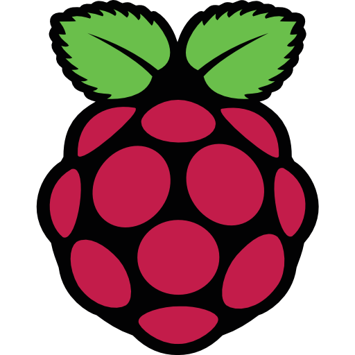

  
   

  <h3><b>6_Autoboot_file</b></h3>

`PASO 1:` Abrir la terminal del Raspberry Pi

`PASO 2:` Digitar `crontab -e`

`PASO 3:` Se visualiza el contenido de `crontab`

`PASO 4:` En la ultima linea se agrega el archivo o script que será ejecutado al inicio del booteo del Sistema Operativo

En este ejemplo se ha utilizado:

@reboot python /home/rasbp4/puenteh/puenteh.py

`@reboot` = Es el comando que indica la ejecucion del archivo o script durante el booteo

`python` = Es para indicar que el archivo o script, a ser ejecutado, es de la naturaleza python

`/home/rasbp4/puenteh/puenteh.py` = Es la ruta donde se ubica el archivo o script

`PASO 5:` Presionar `Ctrl + O` y seguidamente presionar `tecla ENTER`, para guardar los cambios

`PASO 6:` Presionar `Ctrl + X` para salir del crontab

`PASO 7:` Reiniciar el Sistema Operativo para visualizar la ejecucion del archivo o script durante el booteo

`Nota:`

* La ejecucion de los archivos o scripts se realizan durante el booteo del Sistema Operativo (antes de que cargue por completo el Sistema Operativo y se pueda visualizar el Escritorio)
* Si la ejecucion de estos archivos o scripts tienen por objetivo mostrar interfaces graficas o abrir ventanas visuales en el Sistema Operativo, estas no podrán ser mostradas en la pantalla principal
* Salvo usted logré configurar una 2da pantalla y realizar las configuraciones del caso para mostrar interfaces graficas y otros en esta 2da pantalla
* Los archivos o scripts a ejecutar lo harán de forma exitosa con dispositivos o perifericos externos como: Pantalla LCD, circuitos electronicos, motores DC, etc.

